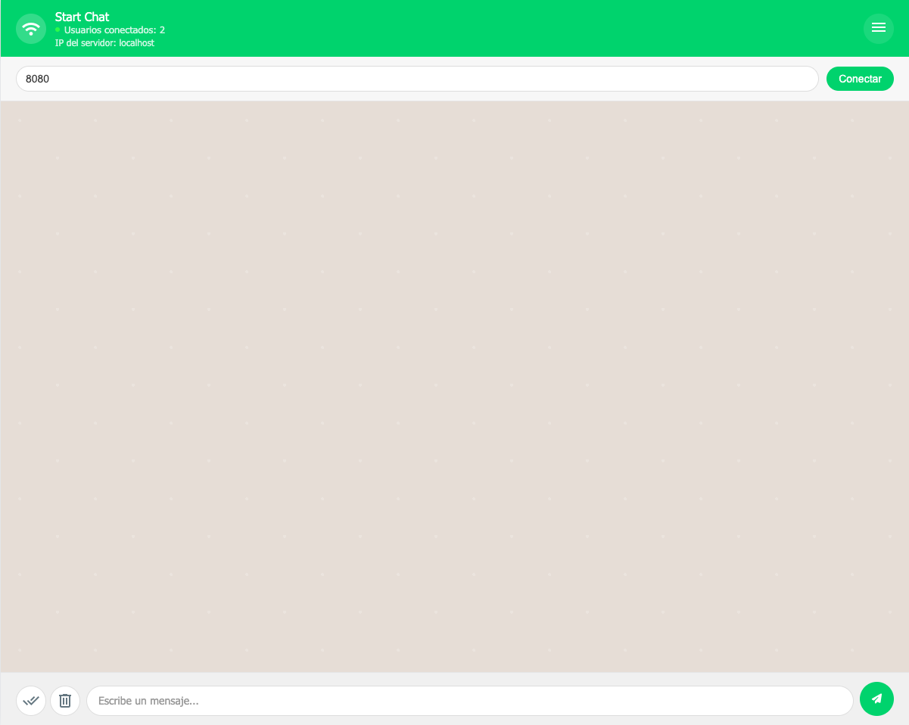

# startchat

·RESPONSIVE·MOBILE·DESKTOP·

Startchat es un sistema de chat en la misma red a través de servidores locales

## Iniciar el servidor del frontend y de la primera sala de chat. 
Para comenzar rápidamente debe iniciar el primer servidor que es el que sirve el front y la sala de chat 8080.  
Ejecute `node server.js` para iniciarlo.  
Debe mostrarle una salida como esta: `Sirviendo el sitio web y el primer servidor de chat desde http://localhost:8080` 

## Crear salas de chat. 
Puede crear salas de chat en función de cuantas necesite para comunicarse.  
Tenga en cuenta que estas no tienen contraseña por lo que toda persona en la red podrá acceder a ellas.  
Símplemente ejecute `node (numerodelpuerto).js`. Por ejemplo: `node 8081.js`si quiere inciar la sala de chat en el puerto 8081.  

## Sonido de notificaciones.  
Cada vez que hay un nuevo mensaje en la sala de chat a la que se está conectado suena una melodía de notificación.  
Puede cambiar el archivo si no le agrada la actual y hasta hacer una pull request de un sonido mejor (lo recibiremos con gusto).  

### Cambiar sonido notificaciones.  
Para cambiar el sonido de las notificaciones debe cargar un archivo llamado **notification.mp3** en la raíz del proyecto.  

### PR sonidos de notificaciones.  
A la hora de realizar una PR de un sonido de notificación le rogamos tenga en cuenta las siguientes guías:  
- El sonido debe ser corto, de máximo 5 segundos
- Debe ser agradable al oido y melodioso, no un sonido phonk o reggaeton.  
- Debe ser de dominio público, licenciado bajo CCZERO o CC BY.  
- Debe estar en formato mp3.  

## Marcar como leídos.  
Hay un icono <svg xmlns="http://www.w3.org/2000/svg" height="24px" viewBox="0 -960 960 960" width="24px" fill="#e3e3e3"><path d="M268-240 42-466l57-56 170 170 56 56-57 56Zm226 0L268-466l56-57 170 170 368-368 56 57-424 424Zm0-226-57-56 198-198 57 56-198 198Z"/></svg> queal pulsarlo marca como leídos los mensajes y reinicia el contador que se muestra en el título de la página.

## Limpiar chat.  
El botón <svg xmlns="http://www.w3.org/2000/svg" height="24px" viewBox="0 -960 960 960" width="24px" fill="#e3e3e3"><path d="M280-120q-33 0-56.5-23.5T200-200v-520h-40v-80h200v-40h240v40h200v80h-40v520q0 33-23.5 56.5T680-120H280Zm400-600H280v520h400v-520ZM360-280h80v-360h-80v360Zm160 0h80v-360h-80v360ZM280-720v520-520Z"/></svg> elimina todos los mensajes **solo para tí**.

